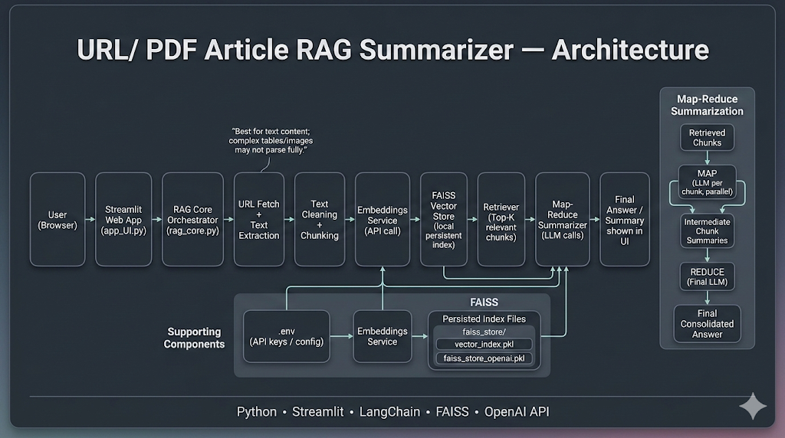

# AI Chat with Article — URL / PDF RAG Summarizer

A simple **RAG (Retrieval-Augmented Generation)** app that lets you paste an **article URL** (and **direct PDF links** when the text is extractable), then get a clean **summary or Q&A** grounded in the source content.

It follows a **Map-Reduce summarization** approach:
- **MAP:** summarize retrieved chunks individually
- **REDUCE:** combine those summaries into one final consolidated answer

Built with **Python + Streamlit + LangChain + FAISS + OpenAI API**.

> Note: This project is optimized for **text content**. If the page/PDF is mostly **tables, images, or scanned pages**, extraction may be incomplete.

---

## What you can do with it

- Paste a URL and get a **quick summary**
- Ask follow-up questions like:
  - “What are the key takeaways?”
  - “What does the author claim about X?”
  - “List the main arguments and evidence”
- The answer is generated using **retrieved chunks** (not random guessing)

---

## Architecture

This repo includes the diagram image already:



**Pipeline (matches the diagram):**

User (Browser) → Streamlit UI (`app_UI.py`) → RAG Orchestrator (`rag_core.py`) →  
Fetch URL/PDF + Extract Text → Clean + Chunk → Embeddings API Call →  
FAISS Vector Store (persistent) → Retriever (Top-K chunks) →  
Map-Reduce Summarizer (LLM calls) → Final Answer shown in UI

**Supporting files:**
- `.env` (API key / config)
- FAISS persistent artifacts (stored locally as `.pkl` files and/or inside `faiss_store/`)

---

## Repo structure (your current files)

```text
.
├── app_UI.py
├── rag_core.py
├── requirements.txt
├── .env
├── image.png
├── faiss_store/                 # folder (may contain persisted artifacts)
├── vector_index.pkl             # persisted index artifact
├── faiss_store_openai.pkl       # persisted store artifact
└── README.md
```
## Clone the repository
```
git clone https://github.com/vishnu1121/AI-Chat-with-Article.git
cd AI-Chat-with-Article
```
## Create a virtual environment
### Windows (PowerShell):
```
python -m venv .venv
.venv\Scripts\Activate.ps1
```
### macOS / Linux:
```
python3 -m venv .venv
source .venv/bin/activate
```
## Install dependencies
```
pip install -r requirements.txt
```
## Add your API key
### Create a .env file in the project root (same folder as app_UI.py):
```
OPENAI_API_KEY=your_openai_api_key_here
```
## Run the app
```
streamlit run app_UI.py
```


### How to use the application (typical flow)
Paste an article URL (or a direct PDF link if supported by extraction), or you can directly upload it from your local storage

Click the action that loads/processes/indexes the content

Ask your question / request a summary

The UI shows the final consolidated answer


## What happens behind the scenes
### Text extraction

The app fetches the content and extracts text. This step can vary a lot depending on the website/PDF structure.

### Chunking

The extracted text is cleaned and split into chunks so the pipeline can:

embed efficiently

retrieve the most relevant parts later

avoid huge context windows

### Embeddings + FAISS persistence

Chunks are embedded via the embeddings API and stored locally in FAISS.
That’s why you see files like:

vector_index.pkl

faiss_store_openai.pkl

and/or artifacts inside faiss_store/

### Retrieval (Top-K)

When you ask a question, the query is embedded and FAISS retrieves the Top-K most relevant chunks.

#### Map-Reduce summarization

MAP: the LLM summarizes each retrieved chunk (chunk-level summaries)

REDUCE: the LLM merges those summaries into one final response

This keeps answers structured and reduces long-context messiness.